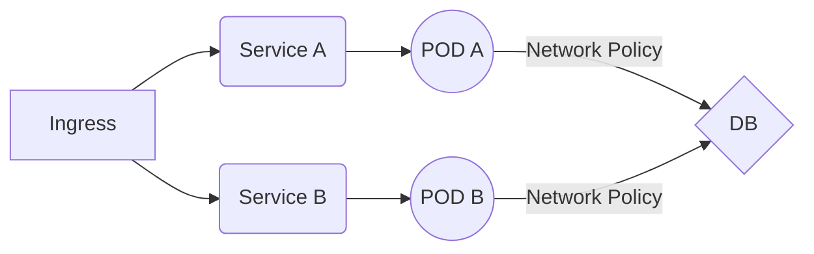

# Kubernetes High Level Concepts

## Network Policies 
[Documentation](https://kubernetes.io/docs/concepts/services-networking/network-policies/)

If you want to control traffic flow at the IP address or port level (OSI layer 3 or 4), then you might consider using Kubernetes NetworkPolicies for particular applications in your cluster. Allow you to specify how a pod is allowed to communicate with various network "entities" (we use the word "entity" here to avoid overloading the more common terms such as "endpoints" and "services", which have specific Kubernetes connotations) over the network. NetworkPolicies apply to a connection with a pod on one or both ends, and are not relevant to other connections.

There are two sorts of isolation for a pod: isolation for egress, and isolation for ingress. A network policy is defined using the [NetworkPolicy](https://kubernetes.io/docs/reference/generated/kubernetes-api/v1.25/#networkpolicy-v1-networking-k8s-io) resource

