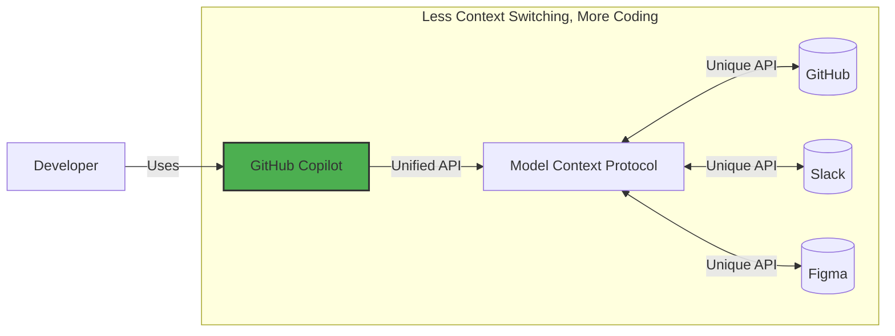

### What is GitHub Copilot?

GitHub Copilot is an AI coding assistant that helps you write code faster and with less effort, allowing you to focus more energy on problem solving and collaboration.

GitHub Copilot has been proven to increase developer productivity and accelerate the pace of software development. For more information, see [Research: quantifying GitHub Copilot’s impact on developer productivity and happiness in the GitHub blog.](https://github.blog/news-insights/research/research-quantifying-github-copilots-impact-on-developer-productivity-and-happiness/)

Your most common interactions will likely be:

- **Inline suggestions**: As you type, Copilot uses the nearby context to suggest code directly in your editor. This will be a familiar interaction if you have used code completion tools like [Intellisense](https://code.visualstudio.com/docs/editor/intellisense), except that the completions may be entire functions.
- **Copilot - Ask Mode**: A dedicated chat panel that lets you ask coding related questions. This will feel familiar if you have used online AI assistant chats. The big difference however, is that your project files will provide automatic context to provide tailored responses.
- **Copilot - Edit Mode**: Similar to Ask mode, but less conversational. Copilot will make changes to your selected files to implement your request.
- **Copilot - Agent Mode**: Copilot will run iteratively until it achieves your request. It will select context, make code changes, run terminal commands, run tools, and most importantly review its work to make adjustments.

Tip

You can learn more about current and upcoming features in the [GitHub Copilot Features](https://docs.github.com/en/copilot/about-github-copilot/github-copilot-features) documentation. You can also select different [models](https://docs.github.com/en/github-models) and make your own [extensions](https://github.com/features/copilot/extensions), but that's for a different lesson!


### How does Copilot work?

In short, you can think of Copilot like a very specialized coworker. To be effective with them, you need to provide them background (context) and clear direction (prompts). Additionally, different people are better at different things because of their unique experiences (models).

- **How do we provide context?:** In our coding environment, Copilot will automatically consider nearby code and open tabs. If you are using chat, you can also explicitly refer to files.
    
- **What model should we pick?:** For our exercise, it shouldn't matter too much. Experimenting with different models is part of the fun! That's another lesson! 🤖
    
- **How do I make prompts?:** Being explicit and clear helps Copilot do the best job. But unlike some traditional systems, you can always clarify your direction with followup prompts.

There several other ways to supplement Copilot's knowledge and capabilities like [chat participants](https://docs.github.com/en/copilot/using-github-copilot/copilot-chat/github-copilot-chat-cheat-sheet?tool=vscode#chat-participants), [chat variables](https://docs.github.com/en/copilot/using-github-copilot/copilot-chat/github-copilot-chat-cheat-sheet?tool=vscode#chat-variables), [slash commands](https://docs.github.com/en/copilot/using-github-copilot/copilot-chat/github-copilot-chat-cheat-sheet?tool=vscode#slash-commands-1), and [MCP tools](https://code.visualstudio.com/docs/copilot/chat/mcp-servers).


What is [@workspace](https://github.com/workspace)?

Great question! This is a specialized [chat participant](https://docs.github.com/en/copilot/using-github-copilot/copilot-chat/github-copilot-chat-cheat-sheet?tool=vscode#chat-participants) that will explore the project repository and try to include relevant additional context.

## [Chat participants](https://docs.github.com/en/copilot/reference/github-copilot-chat-cheat-sheet?tool=vscode#chat-participants)

Chat participants are like domain experts who have a specialty that they can help you with. You can specify a chat participant by typing `@` in the chat prompt box, followed by a chat participant name. To see all available chat participants, type `@` in the chat prompt box.

Below is a list of some of the most common chat participants for using Copilot Chat.

| Variable          | Description                                                                                                                                                                                                                               |
| ----------------- | ----------------------------------------------------------------------------------------------------------------------------------------------------------------------------------------------------------------------------------------- |
| `@azure`          | Has context about Azure services and how to use, deploy and manage them. Use `@azure` when you want help with Azure. The `@azure` chat participant is currently in public preview and is subject to change.                               |
| `@github`         | Allows you to use GitHub-specific Copilot skills. See [Asking GitHub Copilot questions in your IDE](https://docs.github.com/en/copilot/using-github-copilot/asking-github-copilot-questions-in-your-ide#using-github-skills-for-copilot). |
| `@terminal`       | Has context about the Visual Studio Code terminal shell and its contents. Use `@terminal` when you want help creating or debugging terminal commands.                                                                                     |
| `@vscode`         | Has context about Visual Studio Code commands and features. Use `@vscode` when you want help with Visual Studio Code.                                                                                                                     |
| `@workspace`      | Has context about the code in your workspace. Use `@workspace` when you want Copilot to consider the structure of your project, how different parts of your code interact, or design patterns in your project.                            |
| `@professortocat` | **[@professortocat](https://github.com/professortocat)**                                                                                                                                                                                  |

1. Click on any of the related lines and bring up Copilot inline chat by using the keyboard command VSCODE `Ctrl + I` (windows) or `Cmd + I` (mac). IntelliJ `Ctrl + G` & `Ctrl + G`. Terminal `ghcs` - Suggest a command. (Terminal Chat feature coming - https://devblogs.microsoft.com/commandline/github-copilot-in-windows-terminal/)
    
    > **Tip:** Another way to bring up Copilot inline chat is: `right click` on any of the selected lines -> `Copilot` -> `Editor Inline Chat`.
    

# Use edit mode in VS Code

With chat _edit mode_ in Visual Studio Code, you can use natural language to make edits across multiple files in your project. The edits are applied directly in the editor, where you can review them in-place, with the full context of the surrounding code.

By selecting specific files and providing clear context, you can guide edit mode to make targeted code changes and improvements.


# Integrate MCP with Copilot

Expand GitHub Copilot's capabilities with Model Context Protocol (MCP).

### What is Model Context Protocol (MCP)?

[Model Context Protocol (MCP)](https://modelcontextprotocol.io/introduction) is often referred to as "USB-C for AI" - a universal connector that allows GitHub Copilot (and other AI tools) to seamlessly interact with other services.

 It is a way to describe the capabilities and requirements of a service, so AI tools can easily determine what methods to use and to accurately provide the parameters. An MCP server is providing that interface.
 



### Add the GitHub MCP server

1. Inside your codespace, open the **Copilot Chat** panel and verify **Agent** mode is selected.
    
    [](https://private-user-images.githubusercontent.com/37269996/426301455-201e08ab-14a0-48bf-824e-ba4f8f43f8ab.png?jwt=eyJhbGciOiJIUzI1NiIsInR5cCI6IkpXVCJ9.eyJpc3MiOiJnaXRodWIuY29tIiwiYXVkIjoicmF3LmdpdGh1YnVzZXJjb250ZW50LmNvbSIsImtleSI6ImtleTUiLCJleHAiOjE3NTIyMjM5MjEsIm5iZiI6MTc1MjIyMzYyMSwicGF0aCI6Ii8zNzI2OTk5Ni80MjYzMDE0NTUtMjAxZTA4YWItMTRhMC00OGJmLTgyNGUtYmE0ZjhmNDNmOGFiLnBuZz9YLUFtei1BbGdvcml0aG09QVdTNC1ITUFDLVNIQTI1NiZYLUFtei1DcmVkZW50aWFsPUFLSUFWQ09EWUxTQTUzUFFLNFpBJTJGMjAyNTA3MTElMkZ1cy1lYXN0LTElMkZzMyUyRmF3czRfcmVxdWVzdCZYLUFtei1EYXRlPTIwMjUwNzExVDA4NDcwMVomWC1BbXotRXhwaXJlcz0zMDAmWC1BbXotU2lnbmF0dXJlPTBhYjBkM2U2Zjk5NmQxYzFhMmQzNjIxNDgzNWFmZDE2ZGE4ZDU5NmZmNjUxYTY0OWNhM2NhNDhhOWExODI4OGQmWC1BbXotU2lnbmVkSGVhZGVycz1ob3N0In0.pMwxt9_1MnIniUQ00jxP_AZfbZ7343-iZbJ2aMis0ug)Agent mode missing?  
    
    - [](https://code.visualstudio.com/docs/configure/settings#_workspace-settings)
        
        [](https://private-user-images.githubusercontent.com/37269996/430670894-407a79dd-707e-471b-b56b-1938aece4ad8.png?jwt=eyJhbGciOiJIUzI1NiIsInR5cCI6IkpXVCJ9.eyJpc3MiOiJnaXRodWIuY29tIiwiYXVkIjoicmF3LmdpdGh1YnVzZXJjb250ZW50LmNvbSIsImtleSI6ImtleTUiLCJleHAiOjE3NTIyMjM5MjEsIm5iZiI6MTc1MjIyMzYyMSwicGF0aCI6Ii8zNzI2OTk5Ni80MzA2NzA4OTQtNDA3YTc5ZGQtNzA3ZS00NzFiLWI1NmItMTkzOGFlY2U0YWQ4LnBuZz9YLUFtei1BbGdvcml0aG09QVdTNC1ITUFDLVNIQTI1NiZYLUFtei1DcmVkZW50aWFsPUFLSUFWQ09EWUxTQTUzUFFLNFpBJTJGMjAyNTA3MTElMkZ1cy1lYXN0LTElMkZzMyUyRmF3czRfcmVxdWVzdCZYLUFtei1EYXRlPTIwMjUwNzExVDA4NDcwMVomWC1BbXotRXhwaXJlcz0zMDAmWC1BbXotU2lnbmF0dXJlPWU3MjZjZjg2MjJhMTFlMTUzZTQ2OTY3NjVlYjJjYmU0OTdjNjA0NjUxZTIyMDRlOTRjMzJhODM0ZWExOGVjYjcmWC1BbXotU2lnbmVkSGVhZGVycz1ob3N0In0.misKLcbF3PyzJjo-AhsAlVLcPdoF2nQdYIX6fx7iK_s)
    
2. Inside your codespace, create a new file named `mcp.json` in the `.vscode` directory and paste the following contents:
    
    📄 **.vscode/mcp.json**
    
    ```json
    {
      "servers": {
        "github": {
          "command": "docker",
          "args": [
            "run",
            "-i",
            "--rm",
            "-e",
            "GITHUB_PERSONAL_ACCESS_TOKEN",
            "ghcr.io/github/github-mcp-server:v0.5.0"
          ],
          "env": {
            "GITHUB_PERSONAL_ACCESS_TOKEN": "${input:github_token}"
          }
        }
      },
      "inputs": [
        {
          "type": "promptString",
          "id": "github_token",
          "description": "GitHub Personal Access Token",
          "password": true
        }
      ]
    }
    ```
    
    > 🪧 **Note:** Entering a hard-coded token is never recommended, you should use input variables or envFiles when an MCP server requires credentials.
    
3. Expand the VS Code terminal panel. Run the following command to view and **make a copy** of your codespace's GitHub Token.
    
    ```shell
       echo $GITHUB_TOKEN
    ```
    
    Why do I need this?  
    
    The MCP server is a separate background process and needs credentials to perform operations. In this case, we use the temporary [codespace authorization](https://docs.github.com/en/enterprise-cloud@latest/codespaces/reference/security-in-github-codespaces#authentication) credential which becomes invalid when the codespace stops.
    
4. In the `.vscode/mcp.json` file, click the **Start** button and provide the token. This has just informed GitHub Copilot of the MCP server's capabilities.
    
    [](https://private-user-images.githubusercontent.com/63016446/431334530-62ee9c06-e9d4-44e4-b6df-f93417474af2.png?jwt=eyJhbGciOiJIUzI1NiIsInR5cCI6IkpXVCJ9.eyJpc3MiOiJnaXRodWIuY29tIiwiYXVkIjoicmF3LmdpdGh1YnVzZXJjb250ZW50LmNvbSIsImtleSI6ImtleTUiLCJleHAiOjE3NTIyMjM5MjEsIm5iZiI6MTc1MjIyMzYyMSwicGF0aCI6Ii82MzAxNjQ0Ni80MzEzMzQ1MzAtNjJlZTljMDYtZTlkNC00NGU0LWI2ZGYtZjkzNDE3NDc0YWYyLnBuZz9YLUFtei1BbGdvcml0aG09QVdTNC1ITUFDLVNIQTI1NiZYLUFtei1DcmVkZW50aWFsPUFLSUFWQ09EWUxTQTUzUFFLNFpBJTJGMjAyNTA3MTElMkZ1cy1lYXN0LTElMkZzMyUyRmF3czRfcmVxdWVzdCZYLUFtei1EYXRlPTIwMjUwNzExVDA4NDcwMVomWC1BbXotRXhwaXJlcz0zMDAmWC1BbXotU2lnbmF0dXJlPWMwM2ZkMzAzNTYzMDljNzAzNWFkMjU0MWI1ODE2MzcyZjQzNzQ2NGNjYzk0NDg1YWMxNjA5MzQ2NzA4NmFlOWMmWC1BbXotU2lnbmVkSGVhZGVycz1ob3N0In0.-ac181v5ab0yj_4ubDt_ck6T0IPMKJHPIcVx0Zj5DZo)
    
    [](https://private-user-images.githubusercontent.com/63016446/431335052-33195908-affe-488f-afef-e759498d1fe8.png?jwt=eyJhbGciOiJIUzI1NiIsInR5cCI6IkpXVCJ9.eyJpc3MiOiJnaXRodWIuY29tIiwiYXVkIjoicmF3LmdpdGh1YnVzZXJjb250ZW50LmNvbSIsImtleSI6ImtleTUiLCJleHAiOjE3NTIyMjM5MjEsIm5iZiI6MTc1MjIyMzYyMSwicGF0aCI6Ii82MzAxNjQ0Ni80MzEzMzUwNTItMzMxOTU5MDgtYWZmZS00ODhmLWFmZWYtZTc1OTQ5OGQxZmU4LnBuZz9YLUFtei1BbGdvcml0aG09QVdTNC1ITUFDLVNIQTI1NiZYLUFtei1DcmVkZW50aWFsPUFLSUFWQ09EWUxTQTUzUFFLNFpBJTJGMjAyNTA3MTElMkZ1cy1lYXN0LTElMkZzMyUyRmF3czRfcmVxdWVzdCZYLUFtei1EYXRlPTIwMjUwNzExVDA4NDcwMVomWC1BbXotRXhwaXJlcz0zMDAmWC1BbXotU2lnbmF0dXJlPTU1Y2IxYzg4NmVkYjc1ZmIxNTc1ZmYwNjJmYmY2NzNmOTk4ODQ2NGVmODFkN2I4YWY4ZWVlNGQ5YzhlMDllNDAmWC1BbXotU2lnbmVkSGVhZGVycz1ob3N0In0.E0Qa_0bFGcUKHr-TJ5nKUSIJdOimlUrUXsSCo40S5Fw)
    
5. In the Copilot side panel, click the **🛠️ icon** to show the additional capabilities.
    
    [](https://private-user-images.githubusercontent.com/63016446/457918387-b1be8b80-c69c-4da5-9aea-4bbaa1c6de10.png?jwt=eyJhbGciOiJIUzI1NiIsInR5cCI6IkpXVCJ9.eyJpc3MiOiJnaXRodWIuY29tIiwiYXVkIjoicmF3LmdpdGh1YnVzZXJjb250ZW50LmNvbSIsImtleSI6ImtleTUiLCJleHAiOjE3NTIyMjM5MjEsIm5iZiI6MTc1MjIyMzYyMSwicGF0aCI6Ii82MzAxNjQ0Ni80NTc5MTgzODctYjFiZThiODAtYzY5Yy00ZGE1LTlhZWEtNGJiYWExYzZkZTEwLnBuZz9YLUFtei1BbGdvcml0aG09QVdTNC1ITUFDLVNIQTI1NiZYLUFtei1DcmVkZW50aWFsPUFLSUFWQ09EWUxTQTUzUFFLNFpBJTJGMjAyNTA3MTElMkZ1cy1lYXN0LTElMkZzMyUyRmF3czRfcmVxdWVzdCZYLUFtei1EYXRlPTIwMjUwNzExVDA4NDcwMVomWC1BbXotRXhwaXJlcz0zMDAmWC1BbXotU2lnbmF0dXJlPTRlNTg3Y2EzOTdlNzcwNTkwMDQ3OTU4MTEwMjk1YTJjODBkN2UyMzAzZDc2ZWRjYmE3NTE4NGEzYmUzMmIzNTEmWC1BbXotU2lnbmVkSGVhZGVycz1ob3N0In0.JBplA7Ar1okYMnoRTY36tEiZ6aRgibScVxtAtWskwDw) [](https://private-user-images.githubusercontent.com/37269996/430548435-99178d1b-adbe-4cf4-ab9c-3a4d29918a13.png?jwt=eyJhbGciOiJIUzI1NiIsInR5cCI6IkpXVCJ9.eyJpc3MiOiJnaXRodWIuY29tIiwiYXVkIjoicmF3LmdpdGh1YnVzZXJjb250ZW50LmNvbSIsImtleSI6ImtleTUiLCJleHAiOjE3NTIyMjM5MjEsIm5iZiI6MTc1MjIyMzYyMSwicGF0aCI6Ii8zNzI2OTk5Ni80MzA1NDg0MzUtOTkxNzhkMWItYWRiZS00Y2Y0LWFiOWMtM2E0ZDI5OTE4YTEzLnBuZz9YLUFtei1BbGdvcml0aG09QVdTNC1ITUFDLVNIQTI1NiZYLUFtei1DcmVkZW50aWFsPUFLSUFWQ09EWUxTQTUzUFFLNFpBJTJGMjAyNTA3MTElMkZ1cy1lYXN0LTElMkZzMyUyRmF3czRfcmVxdWVzdCZYLUFtei1EYXRlPTIwMjUwNzExVDA4NDcwMVomWC1BbXotRXhwaXJlcz0zMDAmWC1BbXotU2lnbmF0dXJlPTE3MTQ1ZDU2NWJlOGZkZWVlYWZhNmU5YTI4MzZjNzY4NTZiYmE2YWQ4OTIzYTU2M2MyZmJmZDc3ZTJhZTEwYzMmWC1BbXotU2lnbmVkSGVhZGVycz1ob3N0In0.lX7-Gr_uCE6aZ77Axld5chf5nTkunzZdp6-780fEU-w)
6. **Commit** and **push** the `.vscode/mcp.json` file to the `main` branch.
    
    > 🪧 **Note:** Pushing directly to `main` is not a recommended practice. It is only to simplify this exercise.
    
7. Now that your MCP server configuration is pushed to GitHub, Mona should already be busy checking your work. Give her a moment and keep watch in the comments. You will see her respond with progress info and the next lesson.


## Agent Mode and an MCP Server for GitHub

Great work! You just connected your first MCP server to GitHub Copilot! 🎉

🚨 It seems the teachers keep submitting bugs and requests! So many good ideas! We should probably look into them and start researching for other upgrades.

Fortunately, with an MCP server for GitHub, triaging these and even doing some research to get ahead should be pretty quick! 🕵️

### How do we use an MCP server's tools?

Good news! The same way you would normally interact with Copilot, natural language. Just keep in mind the available capabilities and any permission restrictions from your token.

So, with the MCP Server available, we can now ask Copilot things beyond just our code. Here are some ideas to imagine the possibilities:

For example:

- Searching issues considering description, comments, and likes.
- To open, update, or close issues on another repository.
- Comparing repositories.
- Learning about other authors you are working with.
- Retrieve an issue, make changes on a branch, and start a pull request.

Isn't that cool?! Now let's do it! 👩‍🚀

### ⌨️ Activity: Quickly find and save ideas

1. Close any open files inside your codespace. This will help reduce unnecessary context.
    
2. Ensure the **Copilot Chat** panel is open and **Agent** mode is selected. Verify the MCP server tools are also still available.
    
3. Ask Copilot to search GitHub for projects similar to this one.
    
    > [](https://camo.githubusercontent.com/3a36e40b2b41d981688c7c86a559d8d87a54a5f9ec50479089c8d15637da31ea/68747470733a2f2f696d672e736869656c64732e696f2f62616467652f2d50726f6d70742d746578743f7374796c653d736f6369616c266c6f676f3d676974687562253230636f70696c6f74)
    > 
    > ```
    > Search for any other repositories for organizing extra curricular activities
    > ```
    
4. When an MCP tool is required, Copilot will ask for permission. **Verify the request** and modify if necessary, then click **Continue**.
    
    [](https://private-user-images.githubusercontent.com/37269996/431456100-229473af-c206-47a4-b356-943b9c9bd946.png?jwt=eyJhbGciOiJIUzI1NiIsInR5cCI6IkpXVCJ9.eyJpc3MiOiJnaXRodWIuY29tIiwiYXVkIjoicmF3LmdpdGh1YnVzZXJjb250ZW50LmNvbSIsImtleSI6ImtleTUiLCJleHAiOjE3NTIyMjU5NTUsIm5iZiI6MTc1MjIyNTY1NSwicGF0aCI6Ii8zNzI2OTk5Ni80MzE0NTYxMDAtMjI5NDczYWYtYzIwNi00N2E0LWIzNTYtOTQzYjljOWJkOTQ2LnBuZz9YLUFtei1BbGdvcml0aG09QVdTNC1ITUFDLVNIQTI1NiZYLUFtei1DcmVkZW50aWFsPUFLSUFWQ09EWUxTQTUzUFFLNFpBJTJGMjAyNTA3MTElMkZ1cy1lYXN0LTElMkZzMyUyRmF3czRfcmVxdWVzdCZYLUFtei1EYXRlPTIwMjUwNzExVDA5MjA1NVomWC1BbXotRXhwaXJlcz0zMDAmWC1BbXotU2lnbmF0dXJlPTZjZTIzZWRjODZhZGM1NjU2MjlhNGVjNzVjYTdhNTg2MmM5ODNkOTQzN2I2MjNiZmNjY2IzZWYxYjM5MzdhMDImWC1BbXotU2lnbmVkSGVhZGVycz1ob3N0In0.EchLAfz5QNZSpasTHErvrHKatpI_tvkuv9HCfLo39mE)
5. Ask Copilot to describe one of the projects. Explore until you find something you like.
    
    > [](https://camo.githubusercontent.com/3a36e40b2b41d981688c7c86a559d8d87a54a5f9ec50479089c8d15637da31ea/68747470733a2f2f696d672e736869656c64732e696f2f62616467652f2d50726f6d70742d746578743f7374796c653d736f6369616c266c6f676f3d676974687562253230636f70696c6f74)
    > 
    > ```
    > Please look at the code for the 3rd option and give me a detailed description of the features.
    > ```
    
6. Use Copilot to compare and generate ideas for enhancements.
    
    > [](https://camo.githubusercontent.com/3a36e40b2b41d981688c7c86a559d8d87a54a5f9ec50479089c8d15637da31ea/68747470733a2f2f696d672e736869656c64732e696f2f62616467652f2d50726f6d70742d746578743f7374796c653d736f6369616c266c6f676f3d676974687562253230636f70696c6f74)
    > 
    > ```
    > Please compare these features to our project. Which would be new?
    > ```
    
7. Nice! Let's have Copilot create issues to save these ideas.
    
    > [](https://camo.githubusercontent.com/3a36e40b2b41d981688c7c86a559d8d87a54a5f9ec50479089c8d15637da31ea/68747470733a2f2f696d672e736869656c64732e696f2f62616467652f2d50726f6d70742d746578743f7374796c653d736f6369616c266c6f676f3d676974687562253230636f70696c6f74)
    > 
    > ```
    > I like it. Let's create issues for these in my repository.
    > ```
    
8. Copilot will ask for permission to create issues on your repository. Click **Continue** for each new issue. Reminder: **verify the request** before running.
    
    [](https://private-user-images.githubusercontent.com/37269996/430743866-52635294-950a-4168-b71e-498eb769f3af.png?jwt=eyJhbGciOiJIUzI1NiIsInR5cCI6IkpXVCJ9.eyJpc3MiOiJnaXRodWIuY29tIiwiYXVkIjoicmF3LmdpdGh1YnVzZXJjb250ZW50LmNvbSIsImtleSI6ImtleTUiLCJleHAiOjE3NTIyMjU5NTUsIm5iZiI6MTc1MjIyNTY1NSwicGF0aCI6Ii8zNzI2OTk5Ni80MzA3NDM4NjYtNTI2MzUyOTQtOTUwYS00MTY4LWI3MWUtNDk4ZWI3NjlmM2FmLnBuZz9YLUFtei1BbGdvcml0aG09QVdTNC1ITUFDLVNIQTI1NiZYLUFtei1DcmVkZW50aWFsPUFLSUFWQ09EWUxTQTUzUFFLNFpBJTJGMjAyNTA3MTElMkZ1cy1lYXN0LTElMkZzMyUyRmF3czRfcmVxdWVzdCZYLUFtei1EYXRlPTIwMjUwNzExVDA5MjA1NVomWC1BbXotRXhwaXJlcz0zMDAmWC1BbXotU2lnbmF0dXJlPTY5YWY2ZDZmNTExMTQwMjA0NWMzNjg0YzkwNmFkZjVmOTYzYmEwMGE3NWFjOGY2ODY5OGEwZWU3M2UwMWY5NWMmWC1BbXotU2lnbmVkSGVhZGVycz1ob3N0In0.oCFtwhBEXLcfvpqu-93SGnGzjmNfEgkkCKy5X9nvVvs)
9. Since we are done researching, let's finish this chat session to clear the context. At the top of the **Copilot Chat** panel, click the **New Chat** icon (plus sign).