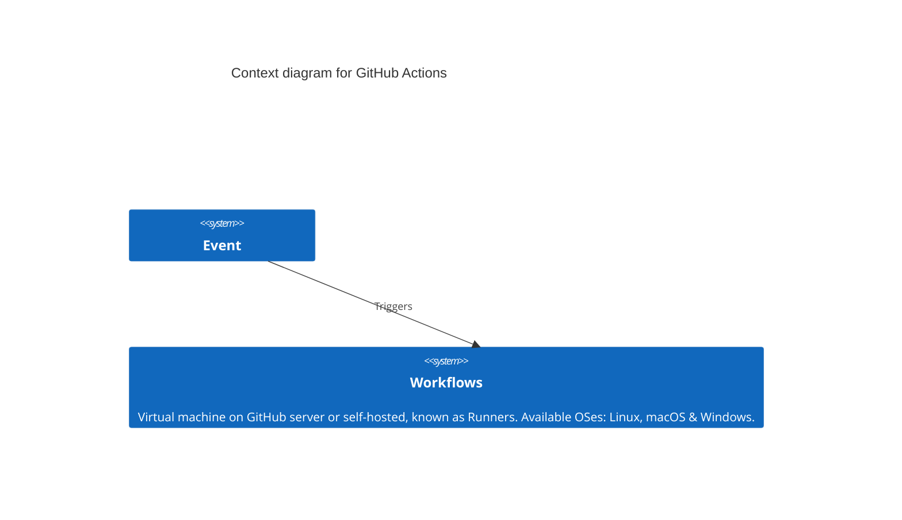
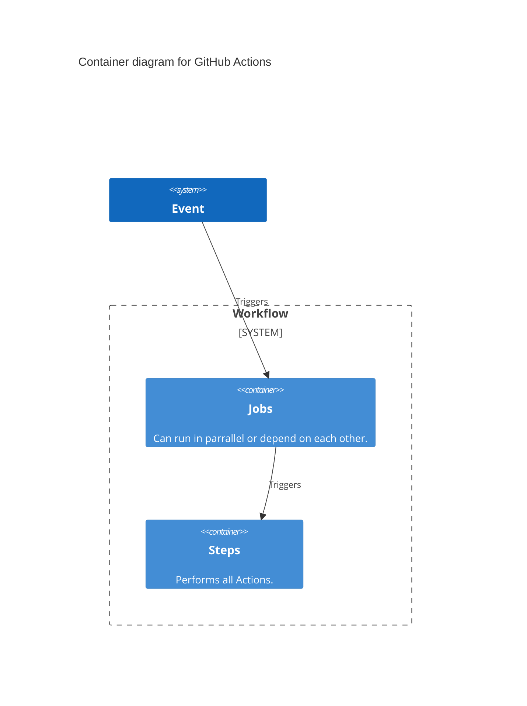

# GitHub

## GitHub Actions

Filter pattern cheat sheet
https://docs.github.com/en/actions/using-workflows/workflow-syntax-for-github-actions#filter-pattern-cheat-sheet

```mermaid
C4Context
title Context diagram for GitHub Actions
System(E, "Event", "")
System(W, "Workflows", "Virtual machine on GitHub server or self-hosted, known as Runners. Available OSes: Linux, macOS & Windows.")
 Rel_L(E, W, "Triggers")
```

```mermaid
C4Container
title Container diagram for GitHub Actions
System(E, "Event", "")
System_Boundary(w, "Workflow"){
  Container(J, "Jobs", , "Can run in parrallel or depend on each other.")
  Container(S, "Steps", , "Performs all Actions.")
}

Rel_L(E, J, "Triggers")
Rel(J, S, "Triggers")
```